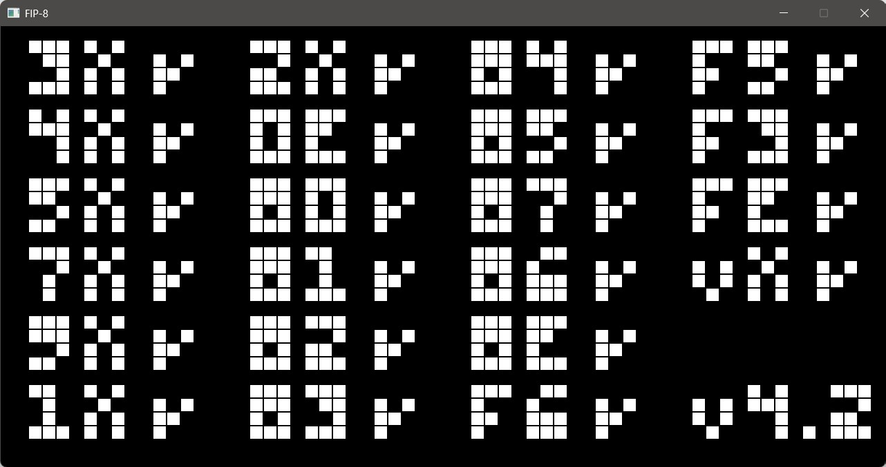

# FIP-8

A CHIP-8 emulator written in F#, supporting the full CHIP-8 instruction set (mostly).

Sound doesn't work, but the sound timer instruction is correctly decoded and executed.
I just need to connect the sound timer to an audio output.

## Features

- Full CHIP-8 instruction set support
- Accurate timing and keypad emulation
- Functional-first programming, with minimal state mutation
- [Raylib-cs](https://github.com/ChrisDill/Raylib-cs) for display and input handling
- Passes Timendus's [chip-8-test-suite](https://github.com/Timendus/chip8-test-suite/)

## Usage

1. Set the ROM path in [Program.fs](./src/Program.fs)
2. Run from IDE or with the following CLI commands:
    ```sh
    dotnet build
    cd ./src
    dotnet run
    ```
3. The keypad is mapped as follows:
    ```
    1 2 3 4        1 2 3 C
    Q W E R   ->   4 5 6 D
    A S D F        7 8 9 E
    Z X C V        A 0 B F
    ```

## Screenshots

IBM Logo running:


All test suites passed:


